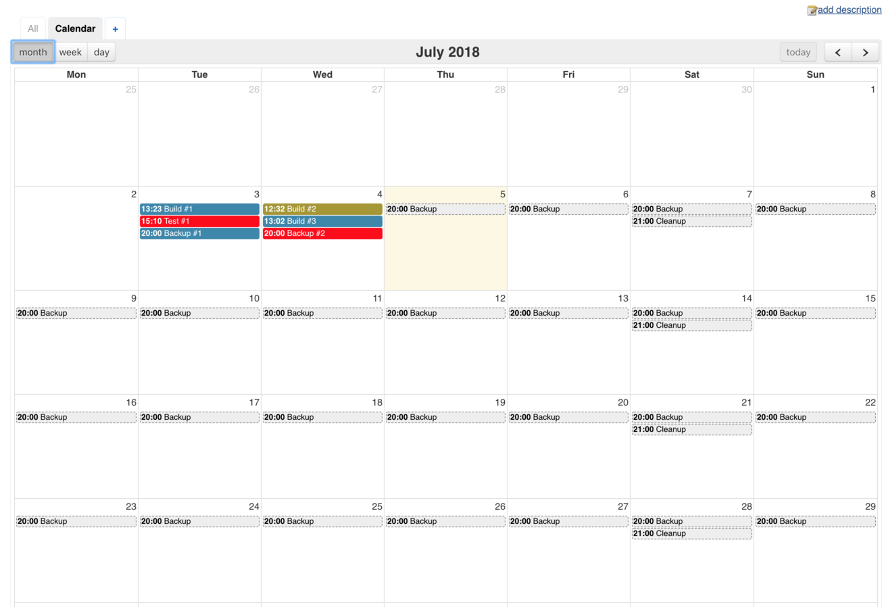
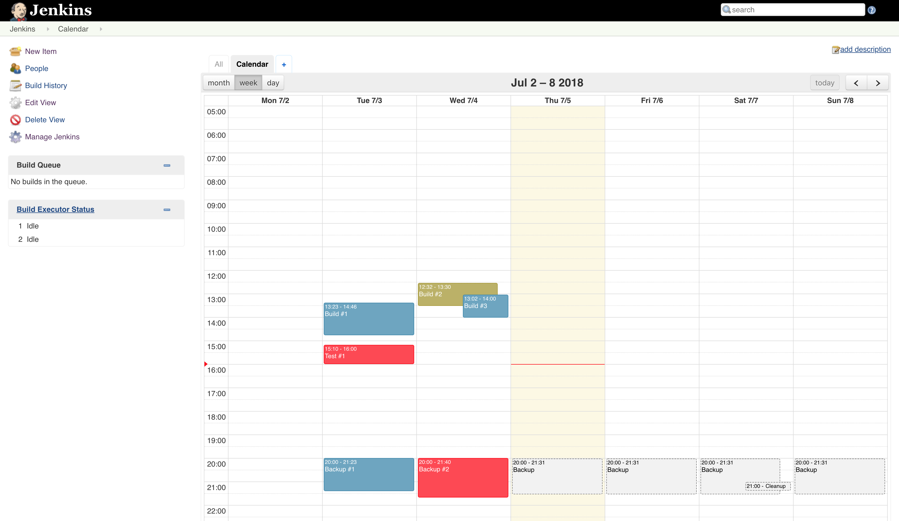
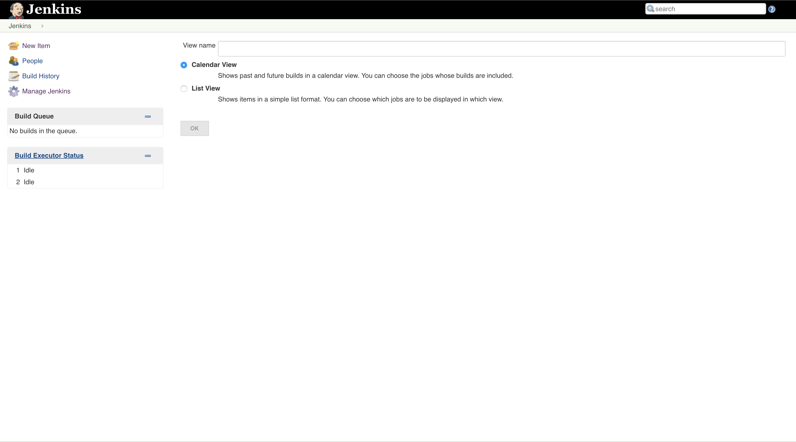
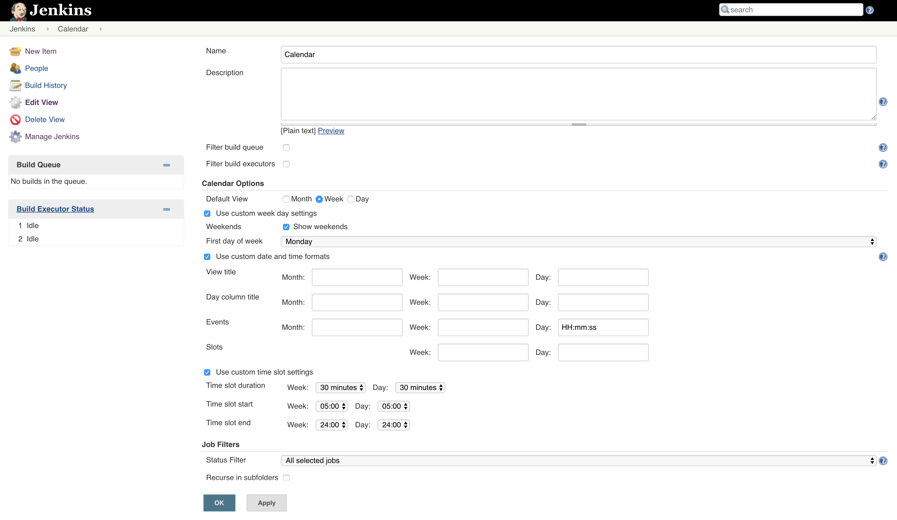

# Jenkins Calendar View Plugin

Shows past and future builds in a calendar view.

|  |  |
|---------------------------------|--------------------------------|

## Features

* Provides a month, week and day view of past and future builds
* Indicates status of past builds by color
* Displays when future scheduled builds will happen
* Shows estimated duration of future scheduled builds
* Configurable date and time settings

## Usage

### 1. Create a new view

Select the *Calendar View* option and give the view a name.

|  |
|----------------------------------|


### 2. Configure the view

Select the jobs whose builds should be displayed in the view and customize the view to your liking:

Tip: to be more flexible in selecting the jobs use the [Jenkins View Job Plugin](https://github.com/jenkinsci/view-job-filters-plugin).

|  |
|----------------------------------|


### 3. Open the view

This will show all the past and future builds for the jobs that you have selected in the previous step.

Note: there is currently no auto refresh available.

#### Past builds

Past builds will appear in four different colors:
* *Successfull* builds will be *blue*
* *Failed* builds will be *red*
* *Unstable* builds will be *yellow*
* *Aborted* builds will be *dark gray*

Clicking on a past build will lead to that specific build's detail page.

#### Future build

*Future* builds are *light gray with a dashed border*.

Clicking on a future build will lead to the job's detail page.

|  |
|---------------------------------|
|   |

## Development

Clone the repository then execute the following in the project's root directory:

```
mvn install
```

This will install Java dependencies as well as a local node installation and npm dependencies.

You can now run the plugin in a Jenkins instance by executing the following:

```
mvn hpi:run
```
